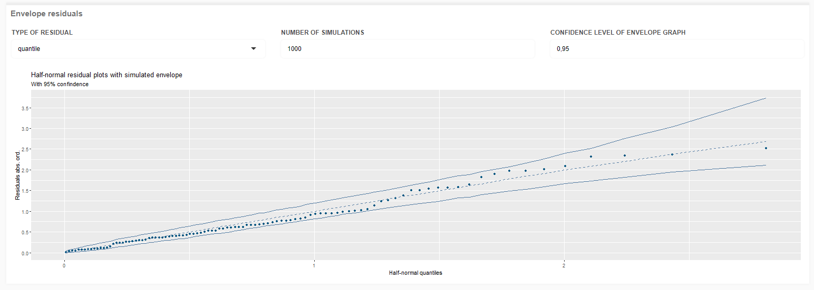

```{r, include = FALSE}
options(rmarkdown.html_vignette.check_title = FALSE)
knitr::opts_chunk$set(
  collapse = TRUE,
  comment = "#>"
)
```

```{r setup}
library(bayesbr)
```


## Introduction

To use bayesbr's shiny application you need to use the following code.

```{r eval=FALSE}
bayesbr::bayesbr_app()
```

To facilitate the use of the package by users who are not used to the programming language or the R language, a shiny application was developed that makes it possible to use the functions of the package through an intuitive and simple visual interface. This Vignette is intended to teach how to use the tools and perform beta Bayesian regression through the application.

```{r, echo=FALSE, fig.cap="Application Home", out.width = '100%'}

```

The Application consists of 3 parts: 

* Data: In this module the user uploads the database to be used;
* Model Fit: In this module, the user adjusts the model settings;
* Results: In this module the user checks the results of the model.

## Data

The visualization of the Data module is divided into 3 parts.

```{r, echo=FALSE, fig.cap="Application Data page", out.width = '100%'}

```

In the Data Select part, it is possible to upload the model database, of the following extensions: xlsx, csv and rds. It's important to emphasize that the variables must be distributed in the columns and the observations in the database rows.

In addition, if the user wants to add a spatial effect to the beta regression, it is possible to upload the neighborhood matrix, with the same types of files supported, this matrix must be: symmetrical, contain the same dimension as the number of observations in the database and binary with the value 1 indicating the neighborhood between the observations. 

If the selected files do not meet the stated requirements, an alert will appear indicating the error, as in the image below.


```{r, echo=FALSE, fig.cap="Selected file error", out.width = '100%'}

```

In the Viewing Data part, it is possible to view the variables and observations of the selected database.


```{r, echo=FALSE, fig.cap="Viewing Data box (illustrative demonstration)", out.width = '100%'}

```
In the Graphs part, it is possible to choose a variable from the database to build histrogram, boxplot and scatter graphs.

```{r, echo=FALSE, fig.cap="Graphs Box - Histogram (illustrative demonstration)", out.width = '100%'}
knitr::include_graphics("images/graph_data1.png")
```

If the user chooses the scatter plot, the application creates one more input so that the variable of the dispersion's y-axis is selected.

```{r, echo=FALSE, fig.cap="Graphs Box - Scatter (illustrative demonstration)", out.width = '100%'}

```

Once the model data selection and visualization is finished, you can go to the Model Fit module.

## Model Fit

The visualization of the model's fit is divided into three main parts: the choice of variables, the prior distribution of the coefficients and the adjustment of the MCMC configuration.

```{r, echo=FALSE, fig.cap="App Model Fit page", out.width = '100%'}

```

The first step in the adjustment is to select the response variable and the independent variables from the model.

Clicking on the input 'RESPONSE VARIABLE', the screen displays all the variables from the previously selected database. For the response variable, it is necessary to select a column with values only between 0 and 1, otherwise the app will show an error.

```{r, echo=FALSE, fig.cap="Selecting model variables (illustrative demonstration)", out.width = '100%'}

```

For the inputs 'COVARIATES FOR MEAN' and 'COVARIATES FOR PRECISION' you can choose the database variables without any restrictions. Previously the option 'Intercept' is already selected to be covariate of the mean and precision.

```{r, echo=FALSE, fig.cap="Error response variable with values outside the range between 0 and 1.", out.width = '100%'}

```

It is also possible to select a variation of the variables listed in the database, with the interaction between variables (symbol ':' followed by the second variable) or the elevation to the second and third potency (symbol '^' followed by the potency number). If you want to do the operation with other potencies, just write the variable followed by the '^' operator and write the potency you want and click on the 'Add' option.

```{r, echo=FALSE, fig.cap="Adding unlisted potencies (illustrative demonstration)", out.width = '100%'}

```

For the priors it is necessary to define if the covariate to be selected is for the mean or precision in the field 'PARAMETER'. The 'COVARIATES' field will list the covariates for the selected parameter, once the covariate is chosen, its prior mean and variance will be displayed, the default is 0 mean and 10 variance, you can change these fields to whatever values you want. After the change click on 'Confirm' to update the values and select another covariate to change.


```{r, echo=FALSE, fig.cap="Covariates prior distribution (illustrative demonstration)", out.width = '100%'}

```
Having selected the variables and informed their priors, it is necessary to adjust the MCMC algorithm setups.

Adjust the number of iterations and the warm-up period, the default for the number of iterations is 1000 and the default for the warm-up is always half the number of iterations. These values cannot be negative or decimal and must be greater than 10.

The field 'POSTERIOR DISTRIBUTION OF PARAMETERS' has the function to choose the parameters that you want to obtain information after the end of the execution.

```{r, echo=FALSE, fig.cap="Default MCMC setup", out.width = '100%'}

```

By clicking on the 'Download R Code' button it is possible to download an R code in case you want to run via script what you have built in the app, and have more detailed results and freedom for your own analysis. To execute the code, click on the 'Execute' button, alerts will be displayed about the progress of the execution. Once finished, it is possible to check the results in the 'Results' tab.

```{r, echo=FALSE, fig.cap="Execution loaders", out.width = '100%'}

```


When a neighborhood matrix is selected in the 'Data' tab, changes are made in the 'Model Fit' tab to include the spatial effect in the model. The field 'SPATIAL EFFECT' is added in which it is possible to select whether to use the spatial effect in any parameter, in mean, in precision or in both.

```{r, echo=FALSE, fig.cap="Selecting model variables with Spatial Effect (illustrative demonstration)", out.width = '100%'}

```
## Results

The results are divided into 3 parts: Model summary, posterior distribution results, and residual envelope plots. The first part consists of the summary function of the bayesbr package, in which it is possible to see information from the adjusted model: residuals, coefficients, model quality measures and other data.

```{r, echo=FALSE, fig.cap="Model summary (illustrative demonstration)", out.width = '100%'}

```

In the results of the posterior distribution, it is possible to choose a parameter (loglik, mean, precision, coefficients of the chosen covariates and, if selected, spatial effects for mean and/or precision) and a type of graph to illustrate the chain of the target parameter.

```{r, echo=FALSE, fig.cap="x2 (precision coefficient) posterior density graph (illustrative demonstration)", out.width = '100%'}

```

For model coefficients and loglik it is possible to display density or traceplot of the chain. As for the mean, precision and possible spatial effects on the parameters, it is possible to see a graph of HPD Intervals for the parameter chain.

```{r, echo=FALSE, fig.cap="Loglik traceplot (illustrative demonstration)", out.width = '100%'}

```

```{r, echo=FALSE, fig.cap="HPD intervals for mean (illustrative demonstration)", out.width = '100%'}

```

It is also possible to display envelope graphs, in the field 'TYPE OF RESIDUAL' the type of residual is selected between 'quantile', 'sweighted', 'pearson' and 'ordinary', you can also choose the confidence level of the envelope and the number of simulations performed to build the graph. The number of simulations must be an integer and positive value and the confidence level a value between 0 and 1.

```{r, echo=FALSE, fig.cap="Envelope graph for quantile residuals (illustrative demonstration)", out.width = '100%'}

```
